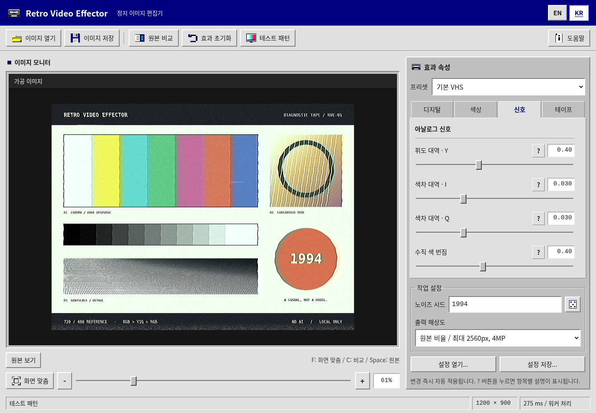

# Retro Video Effector

**앱 단독 버전 2.1.0** · [English](README.md)

Windows 95 스타일의 **로컬 정지 이미지 편집기**입니다. 바탕 화면 위에 창을 띄우지 않고 앱 자체가 페이지를 채웁니다. 시작 버튼, 작업 표시줄, 시계, 앱 창의 최소화·최대화·닫기는 제거했습니다. 남색 제목줄과 회색 입체 버튼은 유지합니다. 실행 시 AI, 이미지 업로드, 원격 폰트, 백엔드, 빌드 과정이 없습니다.



## [실행](<https://jtech-co.github.io/Retro-Video-Effector/>)과 GitHub Pages 배포

ZIP 내용물을 저장소 루트에 올립니다. `index.html`과 `css/`, `js/`, `assets/`가 나란히 있어야 하며 빈 `.nojekyll`도 포함합니다. GitHub Pages의 게시 대상을 해당 루트로 지정합니다. 런타임 자원은 모두 상대 경로를 사용하므로 저장소 하위 경로에서도 같은 구성을 유지합니다.

앱 실행에 `npm install`, Python·Node 애플리케이션 서버, API 키, 번들 생성이 필요하지 않습니다. 포함된 Python·Node 파일은 개발자용 테스트 도구일 뿐입니다.

소스 구조는 `index.html` 직접 열기도 지원하도록 구성했지만, 브라우저 및 관리 기기 정책의 영향을 받습니다. 이번 검증 환경에서는 `file://` 및 브라우저 localhost 탐색이 관리자 정책으로 차단되어 직접 열기 성공을 확인하지 못했습니다. 실제 기능 검사와 정적 HTTP 자원 검사의 구분은 [QA 문서](docs/QA-KR.md)에 기록했습니다. 제작 과정에서 GitHub 계정에 직접 게시한 것은 아닙니다.

## 사용 방법

**이미지 열기**로 파일을 선택하거나, 미리보기 영역에 파일을 끌어다 놓거나 이미지를 붙여넣습니다. **테스트 패턴**은 실제 진단용 이미지를 브라우저에서 생성하는 기능이며 더미 버튼이 아닙니다. 프리셋을 선택하고 **디지털 / 색상 / 신호 / 테이프**의 30개 항목을 조절합니다. 변경은 자동 반영되고 각 **?** 버튼은 해당 효과의 설명을 표시합니다.

**원본 비교**, **원본 보기**, 확대·축소·화면 맞춤, 드래그·핀치로 결과를 확인합니다. **이미지 저장**은 PNG/JPEG 저장 대화상자를 열며, 미리보기 화면이 아니라 전체 가공 이미지 버퍼를 저장합니다. 비교선·앱 UI는 출력 이미지에 포함되지 않습니다. **설정 열기 / 설정 저장**은 JSON 입출력 기능이며 version 1 설정도 읽습니다. **효과 초기화**는 효과와 노이즈 시드를 초기값으로 되돌리고 현재 이미지와 해상도 선택은 유지합니다.

**EN / KR**로 표시 언어를 직접 선택합니다. 버튼, 파라미터 설명, 대화상자, 접근성 이름, 저장 형식, 상태 문구가 바뀌며 이미지·효과 값·선택 탭·확대 상태는 유지됩니다. localStorage가 허용되면 언어 선택을 기록합니다. 저장소 접근이 차단돼도 현재 페이지에서 언어 전환은 가능합니다. 일본어를 거치는 순환 버튼이나 KO 표시는 없습니다.

**PNG 공유**는 브라우저가 파일 공유 기능을 지원한다고 보고한 경우에만 표시됩니다. 미지원 환경에는 이 버튼 자체가 없으며 PNG/JPEG 저장 기능은 유지합니다. 운영체제 정책이나 권한 문제로 공유가 거부되면 이미지 저장 기능을 사용하도록 안내합니다. 자동으로 이미지를 전송하지 않습니다.

## 글꼴과 배치

맑은 고딕, Apple SD Gothic Neo, Noto Sans KR / Noto Sans CJK KR 등 한글 지원 시스템 글꼴을 우선 사용합니다. 이후 Segoe UI / system-ui로 대체합니다. 폰트 파일과 외부 폰트 요청은 없습니다. 기본 글자는 16px, 일반 조절 항목은 15px, 보조 UI도 14px 이상입니다. 고정폭 글꼴은 숫자와 영문 워드마크에만 사용하고 한글 본문에는 사용하지 않습니다. 이미지 확대나 픽셀화 스타일은 UI 글자에 적용하지 않습니다.

데스크톱은 미리보기와 고정 속성 패널의 2열입니다. 너비 920px 이하에서는 일반 문서 흐름에 따라 위아래로 배치합니다. 모바일에서 글자를 작게 줄여 맞추지 않으며, 모든 효과와 저장 설정을 스크롤해 조작할 수 있습니다. 사이드 드로어나 슬라이드 패널은 없습니다.

## 지원 범위

제품명과 별개로 **정지 이미지용**입니다. PNG, JPEG, WebP, AVIF, GIF, BMP는 브라우저의 디코더 지원에 따라 읽습니다. 애니메이션은 정지 프레임으로 처리하며 움직임을 보존하지 않습니다. HEIC, SVG, 동영상은 지원하지 않습니다. 투명 영역은 검정 배경에 합성합니다.

입력은 최대 40MiB / 40MP, 한 변 32768px까지입니다. 출력은 비율을 유지하면서 긴 변 최대 2560px 및 전체 4MP로 제한합니다. 긴 변 1440px 또는 720px 제한도 선택할 수 있으며 원본보다 확대하지 않습니다.

기존 수치 처리 커널과 파라미터의 기본값·범위·프리셋 결과는 유지했습니다. 외부 참고 서비스의 WASM을 복제한 엔진이 아니며 그 서비스와 픽셀 단위로 같다는 주장도 아닙니다. C/BASIC풍 주석과 함수·prototype 구조는 표현 방식일 뿐 실제 Windows 95 또는 Internet Explorer 지원을 의미하지 않습니다.

## 파일 구성과 검증

```text
index.html                 ZIP 루트의 시작 파일
.nojekyll                  일반 정적 게시용 파일
css/windows95.css          제공된 CSS 템플릿 원문
css/app.css                앱 단독 배치·글꼴·반응형 규칙
js/parameters.js           30개 항목과 4개 프리셋
js/strings.js              영어 / 한국어 문구
js/engine.js               기존 로컬 픽셀 처리 커널
js/processor.js            Blob Worker와 대체 실행
js/demo.js                 진단 이미지 생성
js/app.js                  편집·언어·파일·저장 처리
assets/                    SVG 파비콘과 실제 UI 화면; 폰트 없음
README.md / README-KR.md    영문·한국어 안내
docs/                      변경 이력·버튼 동작표·아키텍처·QA
tests/                     개발자용 선택적 회귀검증
```

[변경 이력](docs/CHANGELOG-KR.md) · [버튼 동작표](docs/ACTIONS-KR.md) · [아키텍처](docs/ARCHITECTURE-KR.md) · [QA와 검증 한계](docs/QA-KR.md) · [출처](NOTICE.md)

선택적 개발자 검증: `node --test tests/engine.test.cjs`, `python tests/static.test.py`, `python tests/browser.test.py`. 브라우저 테스트에는 Playwright, Pillow, Chromium이 필요합니다. 실행 파일 경로가 다르면 `RVE_CHROMIUM` 환경 변수를 지정합니다.

‘AI 없음’은 실행 중 이미지 처리 경로에 관한 설명입니다. 개발 과정에서 AI를 사용하지 않았다는 뜻이 아닙니다. 앱이 영속 저장하는 것은 언어 선택뿐이며 이미지 권리는 원저작권자에게 있습니다. 출처와 첨부 CSS 템플릿의 별도 권리 범위는 [LICENSE](LICENSE), [NOTICE.md](NOTICE.md)에 기록했습니다.
