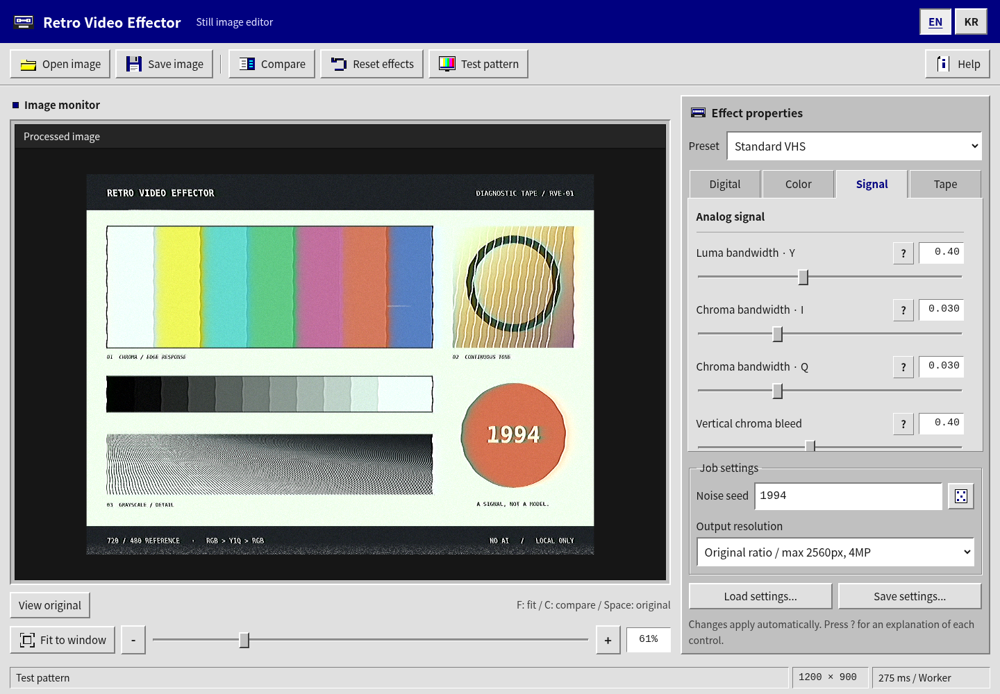

# Retro Video Effector

**Application edition 2.1.0** · [한국어](README-KR.md)

An app-only, Windows 95-style **still-image editor**. The editor fills the page: there is no simulated desktop, Start button, taskbar, clock, or minimize/maximize/close-session controls. Navy and silver beveled controls remain. Image processing is local, with no runtime AI, upload, remote fonts, backend, or build step.



## [Run](<https://jtech-co.github.io/Retro-Video-Effector/>) and deploy

Keep `index.html` beside `css/`, `js/`, and `assets/`. Publish the ZIP contents at the root of a GitHub Pages repository, retaining the empty `.nojekyll`. Every runtime reference is relative, including project-subpath deployment. No npm install, Node/Python application server, API key, or generated bundle is required. The Python/Node files are optional developer tests, not application prerequisites.

Opening `index.html` directly is also supported by the source structure, subject to browser and device security policies. Direct `file://` and browser localhost navigation could not be validated in the supplied environment because the administrator blocked them. See [QA](docs/QA.md) for the exact distinction between real browser functionality, in-memory test loading, and static HTTP resource tests. This release has not been published to a GitHub account by the build process.

## Use

Open or drop an image, or paste an image from the clipboard. **Test pattern** generates a real diagnostic image locally; it is not a placeholder. Choose one of four presets, then adjust the 30 controls in the **Digital / Color / Signal / Tape** tabs. Changes apply automatically. Each **?** button opens a parameter-specific explanation.

Use **Compare**, **View original**, the zoom controls, or drag/pinch within the preview. **Save image** opens a functioning PNG/JPEG export dialog. It saves the processed image buffer, not the preview chrome or comparison divider. **Load settings / Save settings** import/export JSON, including compatibility with version-1 files. **Reset effects** resets the effects and noise seed; it keeps the current image and resolution.

**EN / KR** selects a language directly. Labels, parameter help, dialogs, accessible names, export choices and app status messages switch without resetting the image or settings. The selection is stored when localStorage is permitted; switching still works when storage is denied. No Japanese cycle or ambiguous KO button remains.

The **Share PNG** button appears only when the browser advertises native file-sharing support. Unsupported browsers simply omit it; image downloads remain available everywhere the export APIs work. OS restrictions can still reject a share, in which case the editor directs the user to Save image. No automatic upload occurs.

## Typography and layout

The app uses installed Korean-capable system fonts: Malgun Gothic, Apple SD Gothic Neo, Noto Sans KR / Noto Sans CJK KR, then Segoe UI / system-ui. No font files or font network requests are included. Main type is 16px, normal controls 15px, and supporting UI text at least 14px. Monospaced fonts are limited to numerical readouts and the Latin wordmark. UI text is not rendered as a bitmap or stretched with the image.

Desktop uses two fixed panes. At 920px and below they stack in normal document flow; there are no sliding or off-screen drawers. Mobile does not shrink the type to fit. Parameters and output settings remain reachable by scrolling.

## Scope

Still images only, regardless of the product name. Browser-decodable PNG, JPEG, WebP, AVIF, GIF, and BMP are accepted. Animated input is a still frame; animation is not retained. HEIC, SVG, and video are unsupported. Transparent input is composited over black.

Input: up to 40MiB and 40MP, with a maximum dimension of 32768px. Output preserves aspect ratio within a 2560px long edge and 4MP limit; 1440px and 720px limits are also selectable. Output is never upscaled.

The previous numerical kernel, parameter defaults, ranges and preset results are preserved. This is an independent implementation, not the original external service's WASM engine or a claim of pixel equivalence with that service. Vintage C/BASIC-like comments and ordinary function/prototype organization do not imply compatibility with Windows 95 or Internet Explorer.

## Files and validation

```text
index.html                 Static entry, at the ZIP root
.nojekyll                  Plain static publishing
css/windows95.css          Original supplied style template
css/app.css                App-only layout, typography and responsiveness
js/parameters.js           30 parameter definitions and four presets
js/strings.js              English and Korean text
js/engine.js               Preserved local pixel-processing kernel
js/processor.js            Blob Worker and main-thread fallback
js/demo.js                 Procedural diagnostic image
js/app.js                  Editor, localization, files and export
assets/                    SVG favicon and real UI screenshots; no fonts
README.md / README-KR.md    English and Korean guides
docs/                      Change log, action map, architecture and QA
tests/                     Optional developer regression tests
```

[Changes](docs/CHANGELOG.md) · [Button action map](docs/ACTIONS.md) · [Architecture](docs/ARCHITECTURE.md) · [QA and limitations](docs/QA.md) · [Attribution](NOTICE.md)

For development only: `node --test tests/engine.test.cjs`, `python tests/static.test.py`, and `python tests/browser.test.py`. The browser suite needs Playwright, Pillow and Chromium; set `RVE_CHROMIUM` for a different executable path.

“No AI” describes runtime image processing, not the development process. Only the language preference is persisted by the app. Image rights remain with their owners. See [LICENSE](LICENSE) and [NOTICE.md](NOTICE.md) for attribution and the separate status of the user-supplied CSS template.
